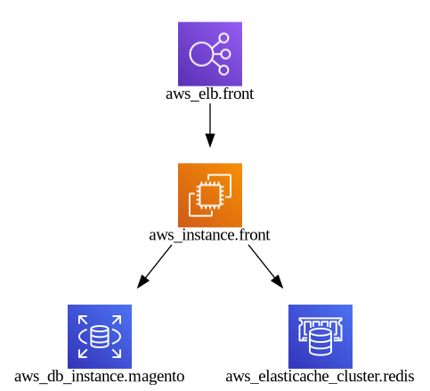
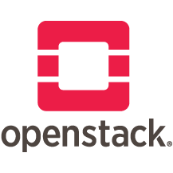
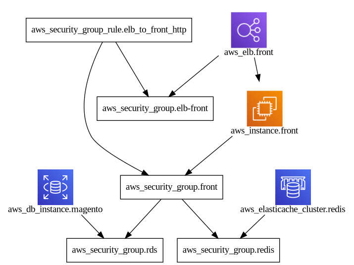
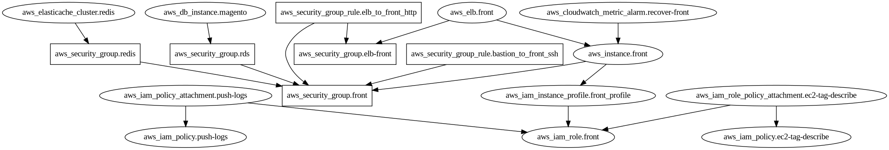

<p align="center">
  
</p>

# InfraMap

[](https://pkg.go.dev/github.com/cycloidio/inframap)
[](https://repology.org/project/inframap/versions)
[](https://formulae.brew.sh/formula/inframap)
[](https://gitter.im/cycloidio/inframap)

Read your tfstate or HCL to generate a graph specific for each provider, showing only the
resources that are most important/relevant.

<p align="center">
  
</p>

## Cloud Providers

We support **all** cloud providers, but we have some (listed below) that we have specific logic that allows
us to better represent information that comes from these providers.

For the other providers the resulting representation will simply be all resources present without any simplification or refinement.

For TFState generations we are limited to versions 3 and 4.

| Provider | State | HCL |  Grouping<sup>1</sup> | External Nodes<sup>2</sup> | IAM<sup>3</sup> |
|:--:|:--:|:--:|:--:|:--:|:--:|
|  | :heavy_check_mark: | :heavy_check_mark: | [WIP](https://github.com/cycloidio/inframap/issues/6) | :heavy_check_mark: | :heavy_multiplication_x: (https://github.com/cycloidio/inframap/issues/11)|
|  | :heavy_check_mark: | :heavy_check_mark: | :heavy_multiplication_x: | :heavy_multiplication_x: | :heavy_multiplication_x: |
|  | :heavy_check_mark: | :heavy_check_mark: | :heavy_multiplication_x: | :heavy_multiplication_x: | :heavy_multiplication_x: |
|  | :heavy_check_mark: | :heavy_check_mark: | :heavy_multiplication_x: | :heavy_multiplication_x: | :heavy_multiplication_x: |
|  | :heavy_check_mark: | :heavy_check_mark: | :heavy_multiplication_x: | :heavy_multiplication_x: | :heavy_multiplication_x: |

1. **Grouping**: Group elements that belong to the same group like VPCs or regions
2. **External Nodes**: Show the ingress of the Nodes if any
3. **IAM**: Connections based on IAM (Identity Access Management)

## Installation

### Stable

To install the latest release of Inframap, you can pick one of this methods:
  * pull the latest release from the [Releases](https://github.com/cycloidio/inframap/releases/) page
  * pull the latest docker [image](https://hub.docker.com/r/cycloid/inframap) from the Docker hub
  * use your Linux package manager (only [AUR](https://aur.archlinux.org/packages/inframap) at the moment)

### Development

You can build and install with the latest sources, you will enjoy the new features and bug fixes. It uses Go Modules (1.13+)

```shell
$ git clone https://github.com/cycloidio/inframap
$ cd inframap
$ go mod download
$ make build
```

### Install via brew

If you're macOS user and using [Homebrew](https://brew.sh/), you can install via brew command:

```sh
$ brew install inframap
```

## Usage

The `inframap --help` will show you the basics.

[](https://asciinema.org/a/347600)

The most important subcommands are:

* `generate`: generates the graph from STDIN or file.
* `prune`: removes all unnecessary information from the state or HCL (not supported yet) so it can be shared without any security concerns

### Example

Visualizing with [dot](https://graphviz.org/download/)

```shell
$ inframap generate state.tfstate | dot -Tpng > graph.png
```

or from the terminal itself with [graph-easy](https://github.com/ironcamel/Graph-Easy)

```shell
$ inframap generate state.tfstate | graph-easy
```

or from HCL

```shell
$ inframap generate config.tf | graph-easy
```

or HCL module

```shell
$ inframap generate ./my-module/ | graph-easy
```

using docker image (assuming that your Terraform files are in the working directory)

```shell
$ docker run --rm -v ${PWD}:/opt cycloid/inframap generate /opt/terraform.tfstate
```


**Note:** InfraMap will guess the type of the input (HCL or TFState) by validating if it's a JSON and if it fails then we fallback
to HCL (except if you send a directory on args, the it'll use HCL directly), to force one specific type you can use `--hcl` or `--tfstate` flags.

## How is it different to `terraform graph`

[Terraform Graph](https://www.terraform.io/docs/commands/graph.html) outputs a dependency graph of all the resources on the tfstate/HCL. We try to go one step further,
by trying to make it human-readable.

If the provider is not supported, the output will be closer to the Terraform Graph version (without displaying provider / variable nodes)

Taking https://github.com/cycloid-community-catalog/stack-magento/ as a reference this is the difference in output:

With `terraform graph`:

<p align="center">
  
</p>

With `inframap generate ./terraform/module-magento/ | dot -Tpng > inframap.png`:

<p align="center">
  
</p>

With `inframap generate --connections=false ./terraform/module-magento/ | dot -Tpng > inframapconnections.png`:

<p align="center">
  
</p>

With `inframap generate ./terraform/module-magento/ --raw | dot -Tpng > inframapraw.png`:

<p align="center">
  
</p>

## How does it work?

For each provider, we support specific types of connections; we have a static list of resources that can be
nodes or edges. Once we identify the edges, we try to create one unique edge from the resources they connect.

For a state file, we rely on the `dependencies` key (for the <0.13 we replace all `depends_on` for `dependencies` so we support them) and, for HCL we rely on interpolation to create the base graph one which we then
apply specific provider logic if supported. If not supported, then basic graph is returned.

## FAQ

### Why is my Graph generated empty?

If a graph is returned empty, it means that we support one of the providers you are using on your HCL/TFState but we do
not recognize any connection or relevant node.

To show the configuration without any InfraMap applied logic you can use the `--raw` flag logic and print everything that we read.
If it works, it would be good to try to know why it was empty before so we can take a look
at it as it could potentially be an issue on InfraMap (open an issue if you want us to take a look).

By default unconnected nodes are removed, you can use `--clean=false` to prevent that.

### Does InfraMap support Terraform backends ?

Terraform allows users to use `backends` (S3, Google Cloud Storage, Swift, etc.) in order to store the `terraform.state`. We currently do not support graph generation from `tfstate` stored in such backends. As mentioned in this [issue](https://github.com/cycloidio/inframap/issues/44), it is possible to play around `stdin/out` to generate graph from Terraform backends.

| backend | command                                                                  |
|---------|--------------------------------------------------------------------------|
| S3      | `aws s3 cp s3://bucket/path/to/your/file.tfstate - \| inframap generate` |
| GCS     | `gsutil cat gs://bucket/path/to/your/file.tfstate \| inframap generate`  |
| HTTP    | `terraform state pull \| inframap generate`                              |

## License

Please see the [MIT LICENSE](https://github.com/cycloidio/inframap/blob/master/LICENSE) file.

## Changelog

All notable changes to this project will be documented in this file.

The format is based on [Keep a Changelog](https://keepachangelog.com/en/1.0.0/),
and this project adheres to [Semantic Versioning](https://semver.org/spec/v2.0.0.html).

## Meet Cycloid

[Cycloid](https://www.cycloid.io/) is a hybrid cloud DevOps collaboration platform providing end-to-end frameworks to accelerate and industrialize software delivery.

As of now, we have three open-source tools:

* [TerraCognita](https://github.com/cycloidio/terracognita): Read from your existing cloud providers and generate IaC in Terraform 
* [InfraMap](https://github.com/cycloidio/inframap): Reads .tfstate or HCL to generate a graph specific for each provider
* [TerraCost](https://github.com/cycloidio/terracost): Cloud cost estimation for Terraform in the CLI

...and the functionality of each is also embedded in our DevOps solution, which you can find out more about [here](https://www.cycloid.io/hybrid-cloud-devops-platform).
